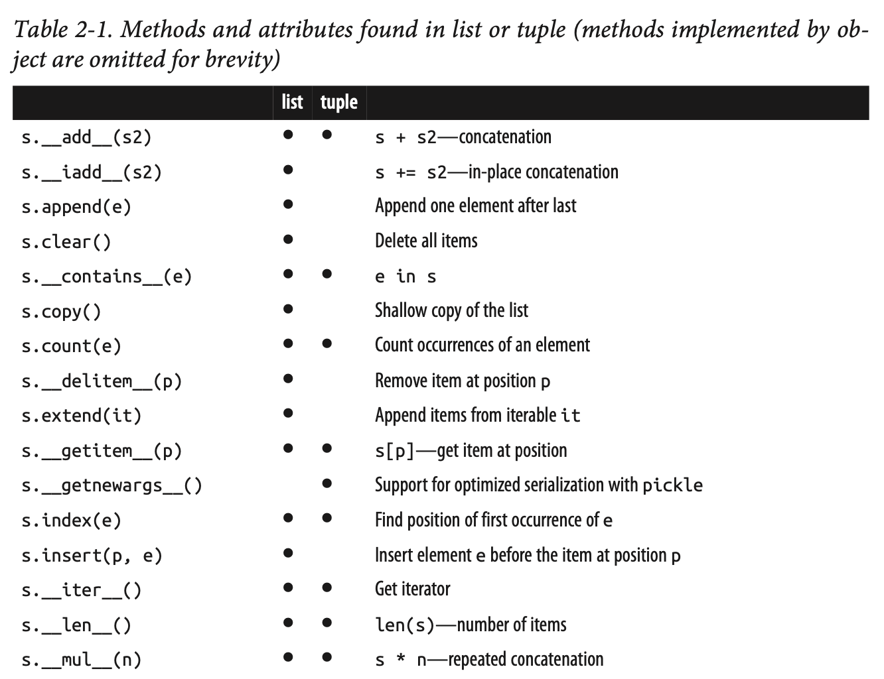
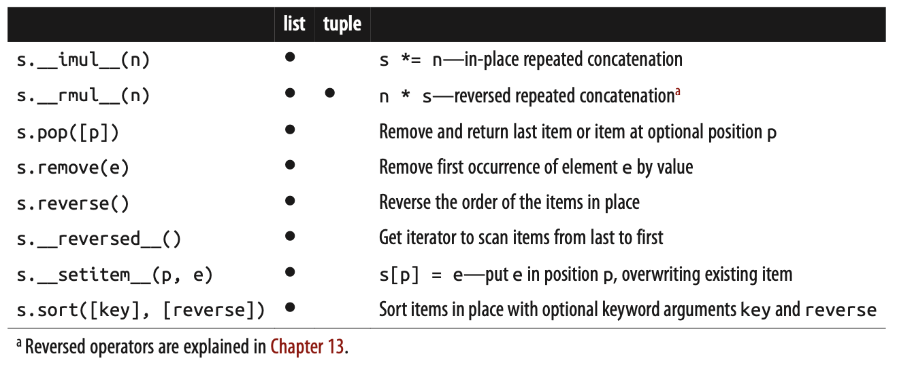

# Exercise: Protocol - linked-list

<!--
`Solution <solution/06_datamodel/solutions.rst>`_
-->

In python there is not a build in linked list. If you want to use this datastructure, you either have to make it yourself or import a module (where someone else did it for you.).

You should chose the first option: create it yourself.

---

## Definition of a linked list

A linked list consists of Node objects with 2 instance variables (data and next).

```python
class Node:
    def __init__(self, data):
        self.data = data
        self.next = None
```

And a LinkedList with 1 instance variable:

```python
class LinkedList:
    def __init__(self):
        self.head = None
```

You can assign Nodes to the list like:

```python
llist = LinkedList()
llist.head = Node('Data of first Node')        # head is a pointer to a Node with data off 'Data of First Node'
llist.head.next = Node('Data of second Node') # next belongs to 'Data of First Node' Node and points to 'Data of second Node' Node.
```

## Task

The Linked List should on a higher level behave like the build in List object. So you could in your interpretor type

```python
>>> help(list)
```

The underscore methods (`__add__` etc.) you can see in the documentation using `help(list)` should be implemented in your LinkedList (or at least as many as possible)

A description of the implemented methods and their behaviour can be seen here:





The features described below should for sure be implement.

* Make you LinkeList able to tell its length if `len(llist)` is called.
* You should be able to access the lists elements like this `llist[1]` and `llist[-1]`
* The list should be able to handle slicing syntax `llist[1:4]` and `llist[-1:-4:-1]`
* The list should be able to add new items using this syntax `llist[3] = Node(3)`
* The llinkedList should be able to return a string representation of its state when calling `str()` and `repr()`
* Make the linkedlist able to being added with another linkedlist using the `+` operator
* Multiply the list x times `llist * 3`

Remember that a very good description of these underscore methods can be found in this weeks reading materials.
